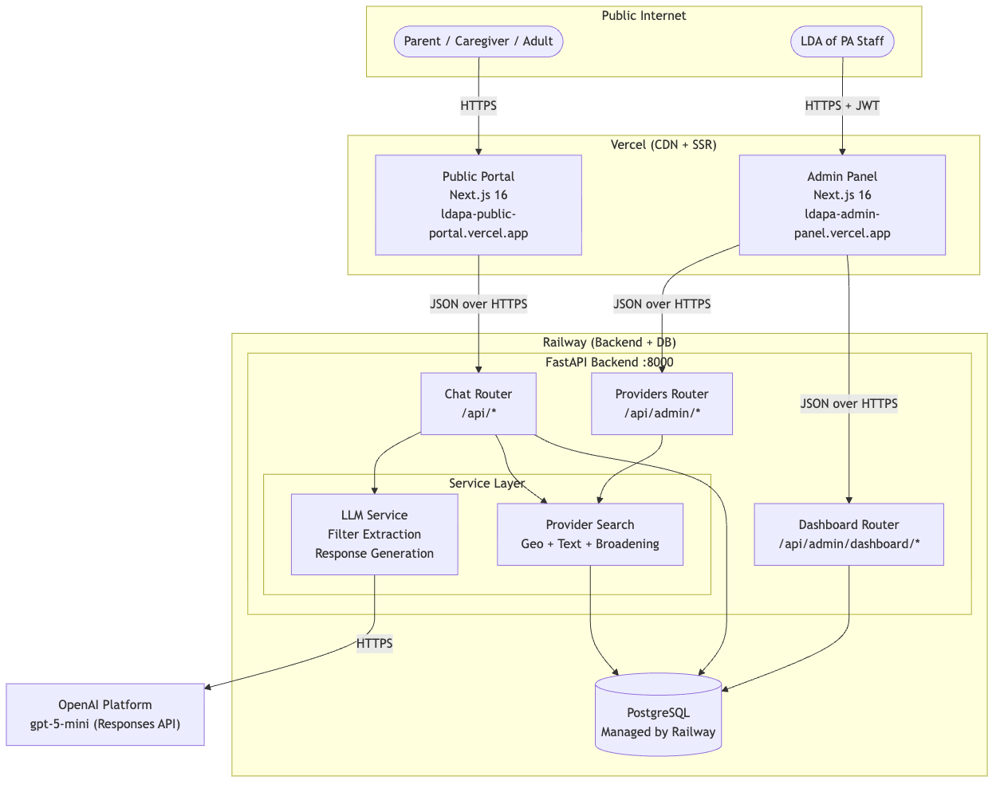
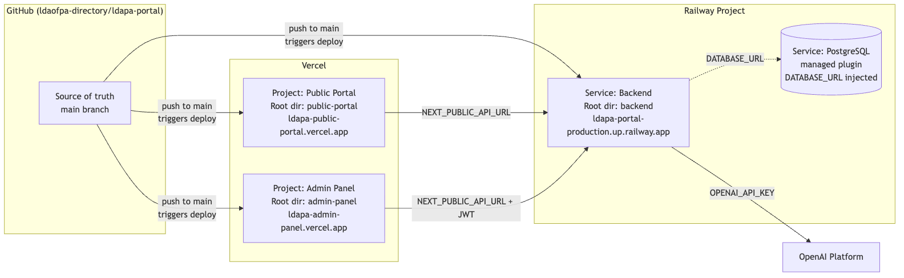

# 02 — System Architecture

**Project:** LDAPA Intelligent Portal
**Scope:** How the running system is laid out, which components talk to which, and what happens inside a single chat turn.

---

## 1. High-Level Architecture



The system is composed of **three applications and one managed database**, split across two hosting platforms plus one external API:

| Component | Runs on | Public URL |
|-----------|---------|------------|
| Public Portal (Next.js) | Vercel | https://ldapa-public-portal.vercel.app |
| Admin Panel (Next.js) | Vercel | https://ldapa-admin-panel.vercel.app |
| FastAPI Backend | Railway | https://ldapa-portal-production.up.railway.app |
| PostgreSQL | Railway (managed plugin) | internal only |
| OpenAI LLM API | OpenAI Platform | https://api.openai.com |

Both frontends talk only to the backend over JSON/HTTPS. The backend is the single source of truth — it is the only component that talks to Postgres and to OpenAI. Postgres is not reachable from the public internet; only the backend service inside the same Railway project can connect to it.

---

## 2. Why This Split

- **Vercel is excellent at Next.js.** Zero-config builds, automatic SSL, global edge CDN, previews on every PR. The free tier is generous for two small Next.js apps.
- **Railway is excellent at Python + Postgres.** One dashboard for the FastAPI service, the managed Postgres instance, logs, metrics, env vars, and rolling deploys. Again, free-tier-friendly.
- **Keeping frontends and backend on separate platforms** means a frontend build error can't take the API down, and vice versa.

---

## 3. Component Responsibilities

### 3.1 Public Portal (`public-portal/`)

- Landing page describing the service
- `/chat` page with the conversational UI
- Session management (stores session ID in React state; echoes it on every subsequent request)
- Renders provider cards when the backend response includes them
- Renders markdown (via `react-markdown`) for formatted assistant replies
- Sends thumbs-up/down feedback events to the backend

Has **no authentication** — anyone can visit and use it.

### 3.2 Admin Panel (`admin-panel/`)

- `/login` — email/password form, stores the returned JWT in `localStorage` as `ldapa_admin_token`
- `/(admin)/overview` — dashboard: provider counts, chat volume chart, feedback score, top user themes
- `/(admin)/providers` — list, search, filter, bulk actions; `new` and `[id]/edit` pages for CRUD
- `/(admin)/pending-reviews` — queue of unverified providers
- `/(admin)/import-export` — CSV import wizard
- `/(admin)/analytics` — deeper usage analytics
- `/(admin)/audit-log` — admin action history
- `/(admin)/settings` — admin preferences
- Legacy `/dashboard/*` pages kept for backwards compatibility

An `authFetch()` wrapper attaches the Bearer token to every outgoing request; any 401 response boots the user back to `/login`.

### 3.3 FastAPI Backend (`backend/`)

The backend is divided into the following modules:

```
backend/app/
├── main.py               — FastAPI app, CORS, router registration
├── config.py             — environment variable loading
├── database.py           — dual-mode SQLite/PostgreSQL wrapper
├── auth.py               — bcrypt hashing, JWT encode/decode, require_admin dep
├── routers/
│   ├── chat.py           — /api/chat, /api/feedback, /api/health
│   ├── providers.py      — /api/admin/providers/* (CRUD, bulk, import)
│   └── dashboard.py      — /api/admin/login, /api/admin/dashboard/*
├── services/
│   ├── llm.py            — OpenAI client, filter extraction, response generation, fallbacks
│   ├── provider_search.py— tiered search (geo → strict → broadened → state-wide)
│   └── csv_importer.py   — Brilliant Directories CSV parser + validator
├── models/
│   ├── chat.py           — Pydantic request/response models for chat
│   ├── provider.py       — Pydantic models for provider CRUD
│   └── dashboard.py      — Pydantic models for dashboard endpoints
└── prompts/
    ├── filter_extraction.py
    └── response_generation.py
```

### 3.4 PostgreSQL (Railway)

Five tables — see **Doc 4 — Data Modeling** for the full schema and ERD:

- `providers` — the directory (3,610 imported rows)
- `chat_sessions` — one per conversation (anonymous)
- `chat_messages` — one row per user or assistant turn
- `chat_feedback` — thumbs-up / thumbs-down on assistant messages
- `admin_users` — bcrypt-hashed credentials for staff login

---

## 4. Request Flow — A Single Chat Turn


When a user sends "I need a reading tutor in Pittsburgh for my 9-year-old," the backend executes these steps:

### Step 1 — Rate limit + session setup

- `POST /api/chat` is called with `{session_id, message, history}`.
- The rate limiter (30 req / 60 s per session) checks the request. If the user is over the limit they get HTTP 429.
- If no `session_id` was provided (first message), a new UUID is generated and a row is inserted into `chat_sessions`.

### Step 2 — Build conversation context

The full message history (all prior user + assistant turns) is assembled plus the new user message appended. The **whole** history is passed to both LLM calls — the model never sees just the last message in isolation.

### Step 3 — LLM Call 1: Filter Extraction

- Model: `gpt-5-mini` (OpenAI Responses API, reasoning `low`, JSON mode).
- Prompt: `backend/app/prompts/filter_extraction.py` — a system message instructing the model to output the filter JSON.
- Output is parsed, validated, and coerced:
  - `profession_types` filtered against `{tutor, health_professional, lawyer, school, advocate}`
  - `specializations` filtered against `{dyslexia, adhd, ld, learning_differences}`
  - `age_group` filtered against `{children, adolescents, adults}`
  - Strings trimmed, booleans cast, `search_text` capped at 200 chars

### Step 4 — Routing

The router in `chat.py` branches on three flags from the filters:

| Condition | Route |
|-----------|-------|
| `escalate == true` | Skip search; mark the session escalated; response will point to crisis lines |
| `needs_more_info == true` AND user_turn_count < 3 | Skip search; response will ask 1–3 clarifying questions |
| Otherwise (or after 3 user turns) | Run a provider search |

The "after 3 user turns, force a search anyway" override prevents the model from looping endlessly on clarifying questions.

### Step 5 — Provider search (if triggered)


`provider_search.py` runs a tiered fallback:

1. **Geo-based** — if the filters include a ZIP code and we have lat/lon for any provider with that ZIP, search within 30 miles. If zero hits, widen to 75 miles.
2. **Strict text-based** — exact city + age range + profession + any other filters. LIMIT 5.
3. **Relax age** — drop the age-range filter.
4. **Relax city** — go state-wide (PA), keep the age filter.
5. **Relax both** — state-wide with only the most important filters (profession + specialization).

Each pass returns up to 5 rows; the first pass that returns at least one row wins. A `broadened` flag is set if we had to relax filters, so the LLM can say "these aren't exact matches" in its response.

Lawyers get an `ORDER BY` penalty unless the user explicitly asked for a lawyer.

### Step 6 — Build provider context string

The result of Step 5 (or the reason no search ran) is formatted into a plain-text context block:

- `"_ESCALATE_"` if crisis was detected
- `"Need more information from the user..."` for clarifying-question mode
- `"No provider search needed..."` for general-question mode
- `"No matching providers found..."` if search ran but returned zero
- A multi-line list of providers (name, profession, training, city, pricing, insurance, phone, website, credentials) when results exist

### Step 7 — LLM Call 2: Response Generation

- Same model (`gpt-5-mini`), same API, reasoning `low`.
- Prompt: `backend/app/prompts/response_generation.py`, with the provider context interpolated into `{provider_context}`.
- The prompt defines the assistant's persona (warm LDA of PA guide), its boundaries (no diagnosis, no legal advice), and five response patterns (general question, needs info, providers found, no providers, escalation).
- If providers were found, the response contains a `[PROVIDERS]` token. The frontend strips that token and renders the provider cards in its place.

### Step 8 — Persist + respond

- Both messages (user + assistant) are inserted into `chat_messages`.
- The IDs of any providers shown are stored as a JSON array in `providers_shown`.
- `chat_sessions.message_count` is incremented by 2 and `last_message_at` is updated.
- If location was extracted, it's saved to `chat_sessions.user_location` as JSON.
- Response is returned to the frontend with the text, the list of provider cards, and the escalation flag.

---

## 5. Authentication Flow (Admin)


1. Staff enters email + password on `/login`.
2. Browser calls `POST /api/admin/login`.
3. Backend looks up the user in `admin_users`, compares the bcrypt hash of the submitted password.
4. On match, backend issues an HS256 JWT with `{sub: user_id, email, exp: +24h}`.
5. Frontend stores the token in `localStorage` under `ldapa_admin_token`.
6. Every subsequent admin request sends `Authorization: Bearer <token>`.
7. The `require_admin` dependency on every `/api/admin/*` endpoint decodes the token and attaches the payload to the request. Failure → HTTP 401.
8. On 401 the frontend clears the token and redirects to `/login`.

JWT secret: `JWT_SECRET` environment variable on Railway. JWT expiry: 24 hours (`JWT_EXPIRATION_HOURS` in `config.py`). Tokens are stateless — there is no server-side session store to invalidate.

---

## 6. LLM Fallback Mode

If `OPENAI_API_KEY` is unset, or if either OpenAI call raises an exception, the backend falls back to regex/keyword logic:

- **Filter extraction fallback** (`_fallback_filter_extraction` in `llm.py`) — a keyword dictionary maps phrases like "therapist", "tutoring", "dyslexia", "adhd", "affordable" to the corresponding structured fields. A regex extracts any 5-digit ZIP. A list of 20 known PA cities catches city mentions.
- **Response fallback** (`_fallback_response`) — four templated paths (providers found / no results / escalation / ask for more info) produce a basic-but-useful reply.

The fallbacks mean that an OpenAI outage (or an expired API key — see **Doc 6 — Handoff**) degrades the experience but does *not* take the portal down.

---

## 7. Cross-Cutting Concerns

### 7.1 CORS

- Configured in `backend/app/main.py` via the `CORSMiddleware`.
- `CORS_ORIGINS` environment variable is a comma-separated list of Vercel URLs allowed to call the API.
- Currently set to `https://ldapa-public-portal.vercel.app,https://ldapa-admin-panel.vercel.app`.

### 7.2 Rate limiting

- Simple in-memory sliding window in `chat.py` — `dict[session_id, list[timestamps]]`.
- 30 requests per 60 seconds.
- NOTE: If the backend ever runs in more than one replica, this limiter will need to move to Redis (or be replaced by Railway's upstream limits).

### 7.3 Logging

- Python `logging` module at INFO level by default.
- Errors during filter extraction or response generation are logged with `logger.exception` and the fallback path is taken.
- Railway captures stdout/stderr and exposes it in the **Deployments → Logs** tab.

### 7.4 Database connection management

- Every request acquires a connection via `get_db()` and releases it via `release_db()` in a `try/finally`.
- In PostgreSQL mode, `asyncpg.create_pool(min_size=2, max_size=10)` backs the pool.
- In SQLite mode, a fresh connection is opened per request and closed at the end.

### 7.5 Startup behavior

On startup (`lifespan` hook in `main.py`):

1. `init_db()` runs `database/schema.sql` (with `CREATE TABLE IF NOT EXISTS`), which is a no-op if the tables already exist.
2. If the `providers` table is empty, the backend looks for an `export_members*.csv` file in the repo and imports it.
3. The canonical admin user is upserted by primary key, so a redeploy also rotates the admin credentials if they change in code. Email: `directory@ldaofpa.org`; password is the bcrypt hash baked into `database.py`.

This means the first-ever deploy seeds itself; subsequent deploys just start serving.

---

## 8. Deployment Topology



See **Doc 5 — Deployment** for the step-by-step configuration and ongoing management details.

---

## 9. What's Not There (Architectural Gaps)

These are conscious omissions — listed here so whoever maintains the system knows what they'd be adding if these needs arise:

- **No caching layer.** Every chat turn hits OpenAI. There is no Redis / memcached. For the current traffic level, this is fine.
- **No background job queue.** Imports run synchronously inside the HTTP request. A 10,000-row CSV takes seconds, not minutes, so this is acceptable today.
- **No audit log write path.** The `/audit-log` admin page exists in the UI but the backend does not yet write audit events. The table/endpoint would need to be added if compliance requires it.
- **No email notifications.** Nothing is sent to staff or users via email.
- **No full-text search index.** Provider search uses plain `LIKE` queries. At 3,610 rows this is instantaneous; at 100,000+ rows, add PostgreSQL `tsvector` or SQLite FTS5.

---

## 10. Related Documents

- **01 — Technical Requirements and Design**
- **03 — APIs**
- **04 — Data Modeling & DB Population**
- **05 — Deployment**
- **06 — Handoff**
