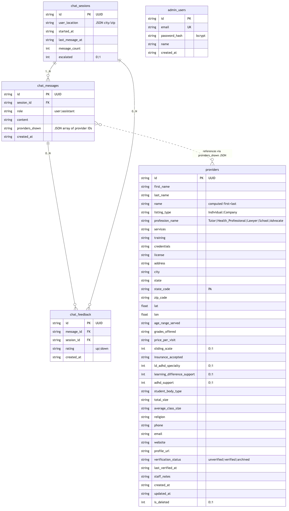

# 04 — Data Modeling & Database Population

**Production database:** PostgreSQL on Railway (managed plugin)
**Local/dev database:** SQLite (`backend/ldapa.db`, auto-created on first run)
**Schema source:** [`database/schema.sql`](../../database/schema.sql) — compatible with both engines
**Initial data source:** `export_members33756-1-1773244920final.csv` (Brilliant Directories LDAPA member export, 3,617 rows, 136 columns)

---

## 1. Entity-Relationship Diagram



Five tables:

| Table | Rows (prod) | Purpose |
|-------|-------------|---------|
| `providers` | 3,610 | The LDA of PA directory — tutors, health professionals, lawyers, schools, advocates |
| `chat_sessions` | grows with usage | One row per conversation (anonymous) |
| `chat_messages` | grows with usage | One row per user or assistant turn |
| `chat_feedback` | grows with usage | Thumbs-up / thumbs-down events |
| `admin_users` | 1 | Staff login credentials (bcrypt-hashed) |

Relationships:

- `chat_messages.session_id` → `chat_sessions.id` (ON DELETE CASCADE)
- `chat_feedback.session_id` → `chat_sessions.id` (ON DELETE CASCADE)
- `chat_feedback.message_id` → `chat_messages.id` (ON DELETE CASCADE)
- `chat_messages.providers_shown` is a JSON array of `providers.id` values — no FK constraint (many-to-many with soft coupling)
- `admin_users` is standalone (no FKs)

---

## 2. Schema

### 2.1 `providers`

The core entity. Stores everything needed to display a provider card, rank it in search, and let staff edit it.

| Column | Type | Notes |
|--------|------|-------|
| `id` | TEXT (PK) | UUID, generated on insert |
| `first_name`, `last_name` | TEXT | From CSV |
| `name` | TEXT NOT NULL | Computed "first last" |
| `listing_type` | TEXT | `Individual` or `Company` |
| `profession_name` | TEXT NOT NULL | One of `Tutor`, `Health_Professional`, `Lawyer`, `School`, `Advocate` |
| `services` | TEXT | Free text sub-services, e.g. `"Therapist,Doctor=>Psychiatrist"` |
| `training` | TEXT | Methodology, e.g. `"Wilson Language Training"`, `"Orton-Gillingham"` |
| `credentials` | TEXT | License numbers, e.g. `"Pennsylvania / SP023530"` |
| `license` | TEXT | License type, e.g. `"Psychologist"` |
| `address` | TEXT | Raw address from CSV `address1` |
| `city` | TEXT | Regex-parsed from address — see §4.2 |
| `state` | TEXT DEFAULT `'PA'` | Full state name |
| `state_code` | TEXT DEFAULT `'PA'` | 2-letter |
| `zip_code` | TEXT | 5-digit |
| `lat`, `lon` | REAL | Used by geo search |
| `age_range_served` | TEXT | Free text, e.g. `"Adults, Teens"` or `"4-65"` |
| `grades_offered` | TEXT | School-only, e.g. `"Grades 1-8"` |
| `price_per_visit` | TEXT | Range, e.g. `"$150 - $250"` |
| `sliding_scale` | INTEGER (0/1) | Affordability flag |
| `insurance_accepted` | TEXT | Free text |
| `ld_adhd_specialty` | INTEGER (0/1) | LD/ADHD specialist flag |
| `learning_difference_support` | INTEGER (0/1) | Supports learning differences |
| `adhd_support` | INTEGER (0/1) | Supports ADHD |
| `student_body_type` | TEXT | School-only: `Co-Ed`, `All-boys`, `All-girls` |
| `total_size` | TEXT | School-only |
| `average_class_size` | TEXT | School-only |
| `religion` | TEXT | School-only |
| `phone`, `email`, `website` | TEXT | Contact info |
| `profile_url` | TEXT | Link to the Brilliant Directories listing |
| `verification_status` | TEXT NOT NULL DEFAULT `'unverified'` | `unverified` / `verified` / `archived` |
| `last_verified_at` | TEXT | ISO timestamp |
| `staff_notes` | TEXT | Admin-only notes |
| `created_at`, `updated_at` | TEXT NOT NULL | ISO timestamp, default `datetime('now')` / `CURRENT_TIMESTAMP` |
| `is_deleted` | INTEGER NOT NULL DEFAULT 0 | Soft-delete flag |

**Indexes:**

```sql
CREATE INDEX idx_providers_city       ON providers (city);
CREATE INDEX idx_providers_zip        ON providers (zip_code);
CREATE INDEX idx_providers_state      ON providers (state_code);
CREATE INDEX idx_providers_status     ON providers (verification_status);
CREATE INDEX idx_providers_profession ON providers (profession_name);
```

### 2.2 `chat_sessions`

| Column | Type | Notes |
|--------|------|-------|
| `id` | TEXT (PK) | UUID |
| `user_location` | TEXT | JSON `{"city":"...","zip":"..."}`; populated only if the user mentioned location |
| `started_at` | TEXT NOT NULL | Default `datetime('now')` / `CURRENT_TIMESTAMP` |
| `last_message_at` | TEXT NOT NULL | Updated on every turn |
| `message_count` | INTEGER NOT NULL DEFAULT 0 | Incremented by 2 per turn (user + assistant) |
| `escalated` | INTEGER NOT NULL DEFAULT 0 | Set to 1 when the LLM detects a crisis |

### 2.3 `chat_messages`

| Column | Type | Notes |
|--------|------|-------|
| `id` | TEXT (PK) | UUID |
| `session_id` | TEXT NOT NULL | FK → `chat_sessions.id` ON DELETE CASCADE |
| `role` | TEXT NOT NULL | `user` or `assistant` |
| `content` | TEXT NOT NULL | The message body (max 10,000 chars) |
| `providers_shown` | TEXT DEFAULT `'[]'` | JSON array of provider IDs rendered with this message |
| `created_at` | TEXT NOT NULL | Default `datetime('now')` |

**Index:** `idx_messages_session ON (session_id, created_at)` — used by the admin chat-transcript view.

### 2.4 `chat_feedback`

| Column | Type | Notes |
|--------|------|-------|
| `id` | TEXT (PK) | UUID |
| `message_id` | TEXT NOT NULL | FK → `chat_messages.id` ON DELETE CASCADE |
| `session_id` | TEXT NOT NULL | FK → `chat_sessions.id` ON DELETE CASCADE |
| `rating` | TEXT NOT NULL | `up` or `down` (API accepts `positive`/`negative` and stores as `up`/`down`) |
| `created_at` | TEXT NOT NULL | Default `datetime('now')` |

**Index:** `idx_feedback_session ON (session_id)`.

### 2.5 `admin_users`

| Column | Type | Notes |
|--------|------|-------|
| `id` | TEXT (PK) | |
| `email` | TEXT NOT NULL UNIQUE | |
| `password_hash` | TEXT NOT NULL | bcrypt `$2b$12$...` |
| `name` | TEXT NOT NULL | |
| `created_at` | TEXT NOT NULL | |

Default seed:
- `id = 'admin1'`
- `email = 'admin@ldapa.org'`
- `password = 'admin123'` (hashed)
- `name = 'LDA of PA Admin'`

**This password must be changed after takeover.** See **Doc 6 — Handoff**.

---

## 3. Source Data: The Brilliant Directories CSV Export

All 3,610 production providers were imported from a single file: `export_members33756-1-1773244920final.csv` — an export of the LDA of PA directory maintained in the Brilliant Directories SaaS.

### 3.1 File characteristics

| Property | Value |
|----------|-------|
| Filename | `export_members33756-1-1773244920final.csv` |
| Encoding | UTF-8 with BOM |
| Delimiter | Comma |
| Row count | 3,617 data rows (3,610 accepted + 7 rejected) |
| Column count | 136 |

The file is checked in at the repo root so that `init_db()` can auto-seed an empty database on first deploy.

### 3.2 Columns used (subset of 136)

Only the following CSV columns are read by the importer — the other ~100 columns (social media handles, appointment links, `cv_url`, `credentials_upload_url`, etc.) are ignored. See `backend/app/services/csv_importer.py` for the exact mapping.

| CSV column | DB column | Transformation |
|-----------|-----------|----------------|
| `first_name`, `last_name` | `first_name`, `last_name`, `name` | Concatenated into `name` |
| `listing_type` | `listing_type` | Direct |
| `profession_name` | `profession_name` | Validated against 5 allowed values; rows with other values still import but log a warning |
| `services` | `services` | Direct |
| `training` | `training` | Direct |
| `credentials` / `Credentials` | `credentials` | First non-empty wins |
| `license` | `license` | Direct |
| `address1` | `address`, `city` (parsed) | Address stored as-is; city extracted via regex (see §4.2) |
| `state_ln` | `state` | Default `"Pennsylvania"` |
| `state_code` | `state_code` | Default `"PA"` |
| `zip_code` | `zip_code` | Direct |
| `lat`, `lon` | `lat`, `lon` | `_safe_float()` — returns `NULL` on `0` or parse failure |
| `agerangeserved` | `age_range_served` | Direct |
| `grades_offered` | `grades_offered` | Direct |
| `pricepervisit` | `price_per_visit` | Direct |
| `Slidingscaleoffered` | `sliding_scale` | `_parse_bool()` — handles `"0"`, `"1"`, `"$1.00"`, `"yes"/"no"` |
| `insurancesaccepted` | `insurance_accepted` | Direct |
| `LDADHDspeciality` | `ld_adhd_specialty` | `_parse_bool()` |
| `learning_difference_support` | `learning_difference_support` | `_parse_bool()` |
| `adhd_support` | `adhd_support` | `_parse_bool()` |
| `student_body_type`, `total_size`, `average_class_size`, `religion` | same | Direct (school-only) |
| `phone_number` / `PhoneNumber` | `phone` | First non-empty |
| `Email` / `email` | `email` | First non-empty; `@ldaofpadirectory.com` placeholders filtered out |
| `website` / `Website` | `website` | First non-empty |
| `profile_url` | `profile_url` | Direct |

Rejected rows (fatal errors) produce entries in the `errors` list and are not inserted:

- Missing both `first_name` and `last_name`
- Missing `profession_name`

Non-fatal warnings (row still imported):

- Unknown `profession_name` (outside the 5 allowed values)
- Could not parse a city from `address1`

### 3.3 City parsing

The Brilliant Directories `city` column is nearly empty (2 rows populated), so cities are extracted from the `address1` free-text field with a two-pattern regex:

1. `"(?:.*,\s*)?([A-Z][a-zA-Z\s.\-']+?),\s*(?:PA|Pennsylvania)\b"` — matches "Pittsburgh" in `"123 Main St, Pittsburgh, PA 15213"`. The match is rejected if the candidate contains digits or is too short (street-name false positive).
2. `"^([A-Z][a-zA-Z\s.\-']+)$"` — matches the whole string when `address1` is bare text like `"East Stroudsburg"`.

If both fail, the importer tries the CSV `city` column, then `City`, then gives up and logs a warning. Net result: city fill rate is 34.3%, compared to 90.6% zip fill rate. Geo search compensates by using lat/lon directly when the user provides a ZIP.

### 3.4 Email placeholder filtering

Brilliant Directories auto-generates placeholder email addresses `@ldaofpadirectory.com` for members who didn't supply one. These are filtered out during import — the DB stores `NULL` instead so staff can see that contact data is genuinely missing.

### 3.5 Import triggers

The CSV can enter the database three ways:

| Trigger | When it runs | Where |
|--------|-------------|-------|
| Auto-import on first boot | Whenever the `providers` table is empty at startup | `backend/app/database.py` → `_import_csv_seed()` |
| Manual production seed | One-time, on handoff of an empty production DB | `backend/seed_production.py` — connects directly via `DATABASE_URL` |
| Admin CSV upload | Any time, via the admin UI | `/import-export` page → `POST /api/admin/providers/import/preview` then `.../import/confirm` |

The admin upload path does **not** deduplicate — the same provider can be inserted twice if the same CSV is uploaded twice. Staff should be aware of this when importing incremental updates.

---

## 4. Database Analytics (Current Production Dataset)

The numbers below reflect the state of the database after the initial CSV import. Run the same queries after any further import to refresh.

### 4.1 Breakdown by profession

| Profession | Count | % of directory |
|-----------|-------|----------------|
| Tutor | 1,529 | 42.4% |
| Health Professional | 1,138 | 31.5% |
| Lawyer | 792 | 21.9% |
| School | 150 | 4.2% |
| Advocate | 1 | 0.03% |
| **Total** | **3,610** | **100%** |

> The single "Advocate" row is a data-quality anomaly — historically most advocates in the directory were classified under `Health_Professional`. Staff may want to reclassify some.

### 4.2 Listing type

| Type | Count |
|------|-------|
| Individual | 3,288 |
| Company | 322 |

### 4.3 Top 10 cities

| City | Count |
|------|-------|
| Philadelphia | 154 |
| Pittsburgh | 89 |
| Bryn Mawr | 34 |
| Media | 26 |
| Lancaster | 25 |
| Allentown | 24 |
| West Chester | 24 |
| Doylestown | 22 |
| Newtown | 22 |
| Bala Cynwyd | 17 |

390 distinct cities are represented in the data.

### 4.4 Top 10 ZIP codes

| ZIP | Count | Area |
|-----|-------|------|
| 19103 | 62 | Center City Philadelphia |
| 19083 | 49 | Havertown |
| 19063 | 45 | Media |
| 19102 | 34 | Rittenhouse Square |
| 19382 | 34 | West Chester |
| 18940 | 32 | Newtown |
| 18901 | 31 | Doylestown |
| 19380 | 31 | West Chester |
| 15219 | 30 | Pittsburgh (Hill District) |
| 19010 | 30 | Bryn Mawr |

### 4.5 Schools by student-body type (150 schools total)

| Type | Count |
|------|-------|
| Co-Ed | 145 |
| All-boys | 4 |
| All-girls | 1 |

### 4.6 Training methodologies (top)

| Methodology | Providers |
|-------------|-----------|
| Wilson Language Training | 1,394 |
| Graduates in Good Standing of the Children's Dyslexia Centers | 110 |
| Wilson Language Certified Trainer | 3 |

(41.8% of providers have any `training` value populated.)

### 4.7 Fill rates by field

| Field | Populated | Fill rate |
|-------|-----------|-----------|
| `zip_code` | 3,270 | 90.6% |
| `lat` / `lon` | 3,166 | 87.7% |
| `email` | 1,551 | 43.0% |
| `training` | 1,510 | 41.8% |
| `website` | 1,403 | 38.9% |
| `phone` | 1,372 | 38.0% |
| `city` | 1,240 | 34.3% |
| `age_range_served` | 1,072 | 29.7% |
| `credentials` | 997 | 27.6% |
| `price_per_visit` | 800 | 22.2% |
| `insurance_accepted` | 770 | 21.3% |

### 4.8 Specialty flags

| Flag | True | % |
|------|------|---|
| `sliding_scale` | 503 | 13.9% |
| `ld_adhd_specialty` | 159 | 4.4% |
| `learning_difference_support` | 34 | 0.9% |
| `adhd_support` | 25 | 0.7% |

### 4.9 Verification status

| Status | Count |
|--------|-------|
| Unverified | 3,610 |
| Verified | 0 |
| Archived | 0 |

**All 3,610 providers are currently `unverified`.** Going through the list and verifying providers is one of the main ongoing tasks for LDA of PA staff.

### 4.10 Database size

| File | Size |
|------|------|
| `ldapa.db` (SQLite dev) | ~2 MB |
| PostgreSQL prod equivalent | ~5–8 MB (estimate) |

The database is tiny by modern standards. There is no scaling concern for the foreseeable future; the current tier on Railway has gigabytes of headroom.

---

## 5. How the Database Changes Over Time

### 5.1 Data the system writes automatically

| Table | Write path |
|-------|-----------|
| `chat_sessions` | `POST /api/chat` — one row per new session |
| `chat_messages` | `POST /api/chat` — two rows per turn (user + assistant) |
| `chat_feedback` | `POST /api/feedback` — one row per thumbs-up/down |

### 5.2 Data staff modify via the admin panel

| Table | Via |
|-------|-----|
| `providers` | Provider CRUD pages, bulk verify/archive, CSV import |
| `admin_users` | (Not exposed — must be updated via SQL or a new endpoint) |

### 5.3 Data nothing modifies

Chat history is **append-only from the app's perspective**. There is no UI to delete a session or redact a message. If a user asks for their data to be deleted (GDPR/CCPA-style), staff would need to run a SQL `DELETE` against `chat_sessions WHERE id = ?` — the CASCADE foreign keys will clean up `chat_messages` and `chat_feedback` automatically.

---

## 6. Backup and Restore

### 6.1 Production (Railway Postgres)

Railway takes automatic daily snapshots of managed Postgres on paid plans. On the free plan, backups are manual — **see Doc 5 — Deployment** for how to take a manual `pg_dump` and where to store it.

### 6.2 Local (SQLite)

The local `ldapa.db` file is the entire database. To back up: `cp backend/ldapa.db backend/ldapa.db.bak`. To restore: copy it back.

---

## 7. Running Your Own Analytics

From the Railway Postgres console (**Data** tab on the Postgres service), you can run arbitrary SQL. Examples:

**Monthly chat volume:**

```sql
SELECT date_trunc('month', started_at::timestamp) AS month, COUNT(*)
FROM chat_sessions
GROUP BY 1 ORDER BY 1 DESC;
```

**Most-shown providers:**

```sql
SELECT p.id, p.name, p.profession_name, COUNT(*) AS times_shown
FROM chat_messages m,
     jsonb_array_elements_text(m.providers_shown::jsonb) AS pid,
     providers p
WHERE p.id = pid
GROUP BY p.id, p.name, p.profession_name
ORDER BY times_shown DESC LIMIT 20;
```

**Feedback rate by week:**

```sql
SELECT date_trunc('week', created_at::timestamp) AS week,
       COUNT(*) FILTER (WHERE rating = 'up')   AS up,
       COUNT(*) FILTER (WHERE rating = 'down') AS down
FROM chat_feedback
GROUP BY 1 ORDER BY 1 DESC;
```

---

## 8. Related Documents

- **01 — Technical Requirements and Design**
- **02 — System Architecture**
- **03 — APIs**
- **05 — Deployment**
- **06 — Handoff**
